# OpenCV

## 图像的概念和基本操作

### 前言

​    OpenCV最主要的功能是用于操作图像，所以图像的概念贯穿整个OpenCV，与其相关的核心类就是cv::Mat。

### 图像与矩阵

 图像指数字图像。


 	以上看到的是一张可视化的图片，但是在计算机中这副图像知识一系列亮度各异的店，该图片的像素为**300 x 200像素**的图，可以用一个3**00\*200的矩阵**来表示，举证元素的值表示这个位置上的像素的亮度，一般来说像素值越大表示该店越亮。 放大“C”后如下图所示：


  	每个点对应的亮度可以理解为rgb的值，无符号8位数3维，则一个像素点为3维数组，分别对应RGB的值，在OpenCV中数据类型为：**CV_8U3C**。
假设M x N，**I**ij表示第j行j列，对应上图就是M = 300， N = 200。


 注意：**在Opencv中三维数组存储RGB值，存储颜色通道的顺序不是RGB，而是BGR**，如下图： 


#### 矩阵类cv::Mat

##### 定义

​    Mat贯穿了整个OpenCV。

​    Mat类的关键定义如下：

~~~C++
class CV_EXPORTS Mat
{
    public:
    // 一系列函数
    ...
    /* flag 参数中包含许多关于矩阵的信息，如：
    -Mat 的标识
    -数据是否连续
    -深度
    -通道数目
    */
    int flags;
    // 矩阵的维数，取值应该大于或等于 2
    int dims;
    // 矩阵的行数和列数，如果矩阵超过 2 维，这两个变量的值都为-1
    int rows, cols;
    // 指向数据的指针
    uchar* data;
    // 指向引用计数的指针
    // 如果数据是由用户分配的，则为 NULL
    int* refcount;
    // 其他成员变量和成员函数
    ...
}
~~~

##### 初始化方式

​    Mat是一个非常优秀的图像类，它同时也是一个通用的矩阵类，可以用来创建和操作多维矩阵。有多种方法创建一个Mat对象。

​    首先了解下数据的类型(举例：**CV_8UC3**)：


初始化函数

~~~c++
// 默认形式
cv::Mat mat;
// 拷贝构造形式
cv::Mat mat(const cv::Mat& mat);
// 指定行列范围的拷贝构造
cv::Mat mat(const cv::Mat& mat, const cv::Range& rows, const cv::Range& cols);
// 指定ROI的拷贝构造
cv::Mat mat(const cv::Mat& mat, const cv::Rect& roi);
// 使用多维数组中指定范围内的数据的拷贝构造
cv::Mat mat(const cv::Mat& mat, const cv::Range* ranges);
// 指定类型和大小(行列)的二维数组（注意：是行在前，列在后)
cv::Mat mat(int rows, int cols, int type);
// 有初始化值的置顶类型和大小(行列)的二维数据
cv::Mat mat(int rows, int cols, int type, const Scalar& s);
// 使用预先存在数据定义的指定类型和大小(行列)的二维数组
cv::Mat mat(int rows, int cols, int type, void *data, size_t step = AUTO_STEP);
// 指定大小和类型的二维数组
cv::Mat mat(cv::Size sz, int type, const Scalar& s);
// 使用预先存在的数据定义的指定大小和类型的二维数组
cv::Mat mat(cv::Size sz, int type, void *data, size_t step = AUTO_STEP);
// 指定类型的多维数据
cv::Mat mat(int ndims, const int *sizes, int type);
// 使用预先存在的数据定义的指定类型的多维数组
cv::Mat mat(int ndims, const int* sizes, int type, void* data, size_t step = AUTO_STEP);
// 使用cv::Vec定义相同类型、大小为n的一维数组
cv::Mat mat(const cv::Vec<T, n>& vec, bool = copyData = true);
// 使用cv::Matx定义相同类型、大小为mxn的二维数组
cv::Mat mat(const cv::Matx<T, m, n>& vec, bool copyData = true);
// 使用STL vector定义相同类型的一维数组
cv::Mat mat(const std::vector<T>& vec, bool copyData = true);
// 使用zeros()函数定义指定大小和类型的cv::Mat（全为0）
cv::Mat mat = cv::Mat::zeros(int rows, int cols, int type);
// 使用ones()函数定义指定大小和类型的cv::Mat（全为0）
cv::Mat ma = cv::Mat::ones(int rows, int cols, int type);
// 使用eye()函数定义指定大小和类型的cv::Mat（恒等矩阵）
cv::Mat mat = cv::Mat::eye(int rows, int cols, int type);
~~~

##### 像素值的读写

​    很多时候，我们需要读取某个像素值，或者设置某个像素值；在更多的时候，
我们需要对整个图像里的所有像素进行遍历。OpenCV提供了多种方法来实现图像的遍历。

* 方法一：at()函数

  ```cpp
      cv::Mat grayim(600, 800, CV_8UC1);
      cv::Mat colorim(600, 800, CV_8UC3);
      // 遍历所有像素，并设置像素值
      for( int i = 0; i < grayim.rows; ++i)
      {
          for( int j = 0; j < grayim.cols; ++j )
              grayim.at<uchar>(i,j) = (i+j)%255;
      }
  
  
      // 遍历所有像素，并设置像素值
      for( int i = 0; i < colorim.rows; ++i)
      {
          for( int j = 0; j < colorim.cols; ++j )
          {
              cv::Vec3b pixel;
              // 注意：opencv通道顺序，BGR，非RGB
              pixel[0] = i%255;  // Blue
              pixel[1] = j%255;  // Green
              pixel[2] = 0;      // Red
              colorim.at<Vec3b>(i,j) = pixel;
          }
      }
  
      imshow("grayim", grayim);
      imshow("colorim", colorim);
  ```

* 方法二：使用迭代器

~~~c++
    cv::MatIterator_<uchar> grayit, grayend;
    for(grayit = grayim.begin<uchar>(), grayend = grayim.end<uchar>();
        grayit != grayend; ++grayit)
    {
        *grayit = rand()%255;
    }
    // 遍历所有像素，并设置像素值
    cv::MatIterator_<cv::Vec3b> colorit, colorend;
    for(colorit = colorim.begin<cv::Vec3b>(), colorend = colorim.end<cv::Vec3b>();
        colorit != colorend; ++colorit)
    {
        (*colorit)[0] = rand()%255; // Blue
        (*colorit)[1] = rand()%255; // Green
        (*colorit)[2] = rand()%255; // Red
    }
~~~

* 方法三：通过数据指针

~~~c++
cv::Mat grayim(600, 800, CV_8UC1);
cv::Mat colorim(600, 800, CV_8UC3);
//遍历所有像素，并设置像素值
for( int i = 0; i < grayim.rows; ++i)
{
    //获取第 i 行首像素指针
    uchar * p = grayim.ptr<uchar>(i);
    //对第 i 行的每个像素(byte)操作
    for( int j = 0; j < grayim.cols; ++j )
    p[j] = (i+j)%255;
}
//遍历所有像素，并设置像素值
for( int i = 0; i < colorim.rows; ++i)
{
    //获取第 i 行首像素指针
    cv::Vec3b * p = colorim.ptr<cv::Vec3b>(i);
    for( int j = 0; j < colorim.cols; ++j )
    {
        p[j][0] = i%255;    //Blue
        p[j][1] = j%255;    //Green
        p[j][2] = 0;        //Red
    }
}
~~~

### 图像局部操作

#### 选择单行/单列

~~~c++
Mat Mat::row(int i) const
Mat Mat::col(int j) const
~~~

 示例： A 矩阵的第i行，将这一行的所有元素都乘以2，然后赋值给第j行 

~~~c++
A.row(j) = A.row(i)*2;
~~~

#### 选择多行/多列

​    Range是OpenCV 中新增的类，该类有两个关键变量star和end。Range 对象可以用来表示矩阵的多个连续的行或者多个连续的列。其表示的范围为从 start到end，包含start。

示例

~~~c++
// 创建一个单位阵
Mat A = Mat::eye(10, 10, CV_32S);
// 提取第 1 到 3 列（不包括 3）
Mat B = A(Range::all(), Range(1, 3));
// 提取B的第 5 至 9 行（不包括 9）
// 其实等价于C = A(Range(5, 9), Range(1, 3))
Mat C = B(Range(5, 9), Range::all());
~~~

#### 选择指定区域

  图像中提取感兴趣区域（Region of interest）有两种方法：

- 方法一：使用构造函数

~~~C++
//创建宽度为 320，高度为 240 的 3 通道图像
Mat img(Size(320, 240), CV_8UC3);
//roi 是表示 img 中 Rect(10, 10, 100, 100)区域的对象
Mat roi(img, Rect(10, 10, 100, 100));
~~~

* 方法二：使用括号运算符

```cpp
    //创建宽度为 320，高度为 240 的 3 通道图像
    Mat img(Size(800, 240), CV_8UC3);


    // 遍历所有像素，并设置像素值
    for( int i = 0; i < img.rows; ++i)
    {
        for( int j = 0; j < img.cols; ++j )
        {
            cv::Vec3b pixel;
            // 注意：opencv通道顺序，BGR，非RGB
            pixel[0] = i%255;  // Blue
            pixel[1] = j%255;  // Green
            pixel[2] = 0;      // Red
            img.at<Vec3b>(i,j) = pixel;
        }
    }

    //roi 是表示 img 中 Rect(10, 10, 100, 100)区域的对象
    Mat roi = img(Range(10, 100), Range(10, 100));

    imshow("img", img);
    imshow("roi", roi);
```


## 读取图片文件

### 读取图像文件，

使用的imread()。imread()函数返回的是Mat对象，如果读取函数文件失败，会返回一个空矩阵（常量cv::Mat::data变量的值是NULL）。

```C++
Mat imread(const string& filename, int flags=1 )
```

filename：是被读取或者保存的图像文件名；
flag：参数值有三种情况：
* flag>0，该函数返回3通道图像，如果磁盘上的图像文件是单通道的灰度图像，则会被强制转为3通道；
* flag=0，该函数返回单通道图像，如果磁盘的图像文件是多通道图像，则会被强制转为单通道；
* flag<0，则函数不对图像进行通道转换。
  

imread()函数支持多种文件格式，且该函数是根据图像文件的内容来确定文件格式，而不是根据文件的扩展名来确定。

支持的图像格式：bmp、dib、jpg、jpeg、jpe、png、pbm、pgm、ppm、sr、ras、tiff、tif、exr、jp2。(需要对应的库支持，开发使用的库要编译时添加进去，然后编译生成opencv库)

### 存储图片文件

​       保存图像文件，使用的imwrite()。   imwrite()函数返回的是bool。

~~~C++
bool imwrite(const string& filename, InputArray image, const vector<int>& params=vector<int>())
~~~

filename 是存成指定的文件名，注意格式是由指定的文件扩展名确定。
* PNG-是无损压缩格式，推荐使用。
* BMP-格式是无损格式，但是一般不进行压缩，文件尺寸非常大；
* JPEG-格式的文件娇小，但是JPEG是有损压缩，会丢失一些信息。

并不是所有的 Mat 对象都可以存为图像文件，目前支持的格式只有8U类型的单通道和3通道（颜色顺序为 BGR）矩阵；如果需要要保存16U格式图像， 只能使用PNG、JPEG 2000和TIFF格式。

如果希望将其他格式的矩阵保存为图像文件，可以先用Mat::convertTo()函数或者cvtColor()函数将矩阵转为可以保存的格式。
注意：在保存文件时，如果文件已经存在，imwrite()函数不会进行提醒，将直接覆盖掉以前的文件。


## 基础数据结构、颜色转换函数和颜色空间

​	对图像的处理，就是对数据结构的处理，OpenCV中常用的数据结构cv::Mat、cv::Point、cv::Scalar、cv::Size、cv::Rect，最基础常用的颜色颜色空间转换函数cvtColor()。 

### 基础数据结构

#### cv::Mat（矩阵）

​    OpenCV中使用cv::Mat来存储，每一个位置存储一个变量，代表该像素点的颜色值，颜色值有多种类型。 矩阵的基础数据类型可以是char（-127~127）、uchar（0~255），float（4字节，32位）、double（8字节、64位）等等，能存储更加精细的颜色分辨能力，与此同时，将会占用更大的内存空间。 

#### cv::Point（点）

​    类似于其他预研框架的点。 点的坐标基础类型还有浮点型以及他基础类型。 

~~~C++
Point pint;
point.x = 20;
point.y = 40;

Point point = Point(20, 40);

// 源码 types.hpp
typedef Point_<int> Point2i;
typedef Point_<int64> Point2l;
typedef Point_<float> Point2f;
typedef Point_<double> Point2d;
typedef Point2i Point;
~~~

#### cv::Scalar（颜色）

​	Scalar表示具有4个元素的数组，初始化时注意颜色顺序为BGRA，而非我们一般默认的RGBA。 

~~~c++
// 黑色
Scalar();
// 蓝色
Scalar(255);
// 绿色
Scalar(0, 255);
// 红色
Scalar(0, 0, 255);
~~~

 	注意：只在颜色处和图像初始化时使用A通道，显示无效，后续会再补充A通道的使用。 

#### cv::Size（大小）

~~~c++
Size size(5, 5);
~~~

#### cv::Rect（矩形）

Rect类的成员变量x、y、width和height，该类有几个基础函数：

* Size()：返回Size类型
* area()：返回矩形的面积
* contains(Point)：判断点是否在矩形内
* inside(Rect)：判断矩形是否在该矩形内
* tl()：返回左上角点的坐标
* br()：返回右下角点的坐标
求矩阵的交集和并集，可以直接使用如下：

~~~c++
Rect rect = rect1 & rect2;
Rect rect = rect1 | rect2;
~~~

 让矩形平移，可以直接使用加减Point： 

~~~c++
Rect rectShift = rect + point;
~~~

 让矩形缩放，可以直接使用加减Size； 

~~~c++
Rect rectShift = rect + size;
~~~

### 常用颜色空间转换函数

#### cvtColor()

函数原型:  cvtColor函数是OpenCV里的颜色空间转换函数，可以实现RGB颜色想HSV、HIS等颜色空间的转换，也可以转换为灰度图像。

~~~c++
void ctvColor(InputArray src, OutputArray dst, int code, int dstCn=0)
~~~

* 参数1：输入图像，可使用cv::Mat类型。
* 参数2：输出图像，可使用cv::Mat类型。
* 参数3：颜色控件转换标识符，标识了从原颜色控件转向目标颜色空间（请参考颜色标识符详细解说）。
* 参数4：颜色通道数，默认为0，输出的图像与输入的图像通道数一致。

### 常用的颜色空间

#### RGB颜色空间

​	计算机色彩显示器和彩色电视机显示色彩的原理一样，都是采用R、G、B相加混色的原理，通过发射出三种不同强度的电子束，使屏幕内侧覆盖的红、绿、蓝磷光材料发光而产生色彩。这种色彩的表示方法称为RGB色彩空间表示。在RGB颜色空间中，任意色光F都可以用R、G、B三色不同分量的相加混合而成：`F=r[R]+r[G]+r[B]`。RGB色彩空间还可以用一个三维的立方体来描述。当三基色分量都为0(最弱)时混合为黑色光；当三基色都为k(最大，值由存储空间决定)时混合为白色光。


#### RGB555

​       RGB555是一种16位的RGB格式，各分量都用5位表示，剩下的一位不用。 高字节 -> 低字节：XRRRRRGGGGGBBBBB

#### RGB565

​      RGB565也是一种16位的RGB格式，但是R占用5位，G占用6位，B占用5位。

#### RGB24

​       RGB24是一种24位的RGB格式，各分量占用8位，取值范围为0-255。

#### RGB32

​       RGB24是一种32位的RGB格式，各分量占用8位，剩下的8位作Alpha通道或者不用。

​		RGB色彩空间采用物理三基色表示，因而物理意义很清楚，适合彩色显象管工作。然而这一体制并不适应人的视觉特点。因而，产生了其它不同的色彩空间表示法。

#### YUV颜色空间

​       YUV(亦称YCrCb)是被欧洲电视系统所采用的一种颜色编码方法。在现代彩色电视系统中，通常采用三管彩色摄像机或彩色CCD摄影机进行取像，然后把取得的彩色图像信号经分色、分别放大校正后得到RGB，再经过矩阵变换电路得到亮度信号Y和两个色差信号R-Y(即U)、B-Y(即V)，最后发送端将亮度和两个色差总共三个信号分别进行编码，用同一信道发送出去。这种色彩的表示方法就是所谓的YUV色彩空间表示。采用YUV色彩空间的重要性是它的亮度信号Y和色度信号U、V是分离的。如果只有Y信号分量而没有U、V信号分量，那么这样表示的图像就是黑白灰度图像。彩色电视采用YUV空间正是为了用亮度信号Y解决彩色电视机与黑白电视机的兼容问题，使黑白电视机也能接收彩色电视信号。

YUV主要用于优化彩色视频信号的传输，使其向后相容老式黑白电视。与RGB视频信号传输相比，它最大的优点在于只需占用极少的频宽（RGB要求三个独立的视频信号同时传输）。其中“Y”表示明亮度（Luminance或Luma），也就是灰阶值；而“U”和“V” 表示的则是色度（Chrominance或Chroma），作用是描述影像色彩及饱和度，用于指定像素的颜色。“亮度”是透过RGB输入信号来建立的，方法是将RGB信号的特定部分叠加到一起。“色度”则定义了颜色的两个方面─色调与饱和度，分别用Cr和Cb来表示。其中，Cr反映了RGB输入信号红色部分与RGB信号亮度值之间的差异。而Cb反映的是RGB输入信号蓝色部分与RGB信号亮度值之同的差异。

YUV和RGB互相转换的公式如下（RGB取值范围均为0-255）︰

~~~c++
Y = 0.299R + 0.587G + 0.114B
U = -0.147R - 0.289G + 0.436B
V = 0.615R - 0.515G - 0.100B
R = Y + 1.14V
G = Y - 0.39U - 0.58V
~~~

#### HSV颜色空间

HSV是一种将RGB色彩空间中的点在倒圆锥体中的表示方法。HSV即色相(Hue)、饱和度(Saturation)、明度(Value)，又称HSB(B即Brightness)。色相是色彩的基本属性，就是平常说的颜色的名称，如红色、黄色等。饱和度（S）是指色彩的纯度，越高色彩越纯，低则逐渐变灰，取0-100%的数值。明度（V），取0-max(计算机中HSV取值范围和存储的长度有关)。HSV颜色空间可以用一个圆锥空间模型来描述。圆锥的顶点处，V=0，H和S无定义，代表黑色。圆锥的顶面中心处V=max，S=0，H无定义，代表白色。


#### CIE-RGB颜色空间

  这个模型是由真实的人眼颜色匹配实验得出的模型，RGB分别表示那三个固定波长的光的份量。 


## 基础图形绘制

  OpenCV基础图形绘制，可用于做图形标记。 

### line 

~~~c++
 cv::line(mat, cv::Point(30, 30) , cv::Point(370, 30) , cv::Scalar(255, 255, 255), 1);
~~~

### ellipse

~~~c++
cv::ellipse(mat, cv::Point(50+1, 50+1) , cv::Size(10, 20), 45.0, 0.0, 360.0, cv::Scalar(0, 0, 255), 1);
~~~

### rectangle

~~~c++
cv::rectangle(mat, cv::Rect(100   , 100   , 20, 20), cv::Scalar(0, 255, 0));
~~~

### circle

~~~c++
cv::circle(mat, cv::Point(200, 200), 10, cv::Scalar(200, 200, 200), -1);
~~~

### fillPoly

~~~c++
 cv::fillPoly(mat, ppt, npt, 1, cv::Scalar(0, 255, 255));
~~~


~~~c++
void BasicGraphicsDrawing()
{

    cv::Mat mat(400, 400, CV_8UC3, cv::Scalar());

    mat = cv::Scalar();
    cv::putText(mat, "Hello world!!!", cv::Point(0, 200), cv::FONT_HERSHEY_COMPLEX, 1, cv::Scalar(0, 0, 255));

    // line
    cv::line(mat, cv::Point(30, 30) , cv::Point(370, 30) , cv::Scalar(255, 255, 255), 1);
    cv::line(mat, cv::Point(370, 30), cv::Point(370, 370), cv::Scalar(255, 255, 255), 1);
    cv::line(mat, cv::Point(370, 370), cv::Point(30, 370), cv::Scalar(255, 255, 255), 1);
    cv::line(mat, cv::Point(30, 370), cv::Point(30 , 30), cv::Scalar(255, 255, 255), 1);

    // ellipse
    cv::ellipse(mat, cv::Point(50+1, 50+1) , cv::Size(10, 20), 45.0, 0.0, 360.0,
                cv::Scalar(0, 0, 255), 1);
    cv::ellipse(mat, cv::Point(50+1, 350-1), cv::Size(10, 20), 135.0, 0.0, 360.0,
                cv::Scalar(0, 0, 255), -1);
    cv::ellipse(mat, cv::Point(350-1, 50+1), cv::Size(20, 10), 45.0, 0.0, 360.0,
                cv::Scalar(0, 0, 255), 1);
    cv::ellipse(mat, cv::Point(350-1, 350-1), cv::Size(20, 10), 135.0, 0.0, 360.0,
                cv::Scalar(0, 0, 255), -1);

    // rectangle
    cv::rectangle(mat, cv::Rect(100   , 100   , 20, 20), cv::Scalar(0, 255, 0));
    cv::rectangle(mat, cv::Rect(100   , 300-20, 20, 20), cv::Scalar(0, 255, 0));
    cv::rectangle(mat, cv::Rect(300-20, 100   , 20, 20), cv::Scalar(0, 255, 0), -1);
    cv::rectangle(mat, cv::Rect(300-20, 300-20, 20, 20), cv::Scalar(0, 255, 0), -1);

    // circle
    cv::circle(mat, cv::Point(200, 200), 10, cv::Scalar(200, 200, 200), -1);
    cv::circle(mat, cv::Point(200, 200), 20, cv::Scalar(200, 200, 200), 1);
    cv::circle(mat, cv::Point(200, 200), 30, cv::Scalar(200, 200, 200), 2);
    cv::circle(mat, cv::Point(200, 200), 40, cv::Scalar(200, 200, 200), 3);
    cv::circle(mat, cv::Point(200, 200), 50, cv::Scalar(200, 200, 200), 4);

    // fillPoly
    cv::Point rootPoints[1][4];
    rootPoints[0][0] = cv::Point(200, 150);
    rootPoints[0][1] = cv::Point(250, 200);
    rootPoints[0][2] = cv::Point(200, 250);
    rootPoints[0][3] = cv::Point(150, 200);
    const cv::Point * ppt[1] = { rootPoints[0] };
    const int npt[] = {4};
    cv::fillPoly(mat, ppt, npt, 1, cv::Scalar(0, 255, 255));

    cv::imshow("1", mat);

}
~~~

## 缩放、旋转、镜像

#### 旋转（90度的整数倍）

 旋转90°的整数就是对矩阵位置进行变换，如下图： 


##### cv::transpose()

 该函数无任何函数，直接对矩阵进行顺时钟旋转90°，函数原型如下： 

~~~C++
CV_EXPORTS_W void transpose(InputArray src, OutputArray dst);
~~~

##### cv::rotate()

 该函数旋转函数，三个枚举可以旋转90°，180°，270°，逆时针旋转90°就是顺时钟270°，函数原型如下： 

~~~C++
CV_EXPORTS_W void rotate(InputArray src, OutputArray dst, int rotateCode);

enum RotateFlags {
    ROTATE_90_CLOCKWISE = 0,         //Rotate 90 degrees clockwise
    ROTATE_180 = 1,                   //Rotate 180 degrees clockwise
    ROTATE_90_COUNTERCLOCKWISE = 2, //Rotate 270 degrees clockwise
};
~~~

#### 翻转函数

##### cv::flip

 该函数为翻转函数，函数圆形如下： 

~~~c++
CV_EXPORTS_W void flip(InputArray src, OutputArray dst, int flipCode);
~~~

- 参数一：输入mat
- 参数二：输出mat
- 参数三：只有3种值，小于0，等于0，大于0，分别对应xy轴翻转、x轴翻转、y轴翻转。

#### 缩放

##### cv::resize

​    该函数为缩放函数，特别注意：函数缩放会失真，尤其是以缩放后的图像继续缩放会原来大小，所以笔者建议，缩放用缓存，缓存存放原图，每次以原图缩放。

​    该函数原形如下：

~~~c++
CV_EXPORTS_W void resize( InputArray src, OutputArray dst,
                          Size dsize, double fx = 0, double fy = 0,
                          int interpolation = INTER_LINEAR );
~~~

- 参数一：输入mat
- 参数二：输出mat
- 参数三：缩放后的大小
- 参数四：x缩放比例，一般默认0就可以
- 参数五：y缩放比例，一般默认0就可以
- 参数六：差值，一般默认即可

​    此处额外介绍下差值的枚举：

~~~c++
enum InterpolationFlags{
    INTER_NEAREST        = 0,	// 最临近差值
    INTER_LINEAR         = 1,   // 双线性差值
    INTER_CUBIC          = 2,   // 双立方差值
    INTER_AREA           = 3,
    INTER_LANCZOS4       = 4,  // 附近像素及原像素加权取值
    INTER_LINEAR_EXACT = 5,
    INTER_MAX            = 7,
    WARP_FILL_OUTLIERS   = 8,
    WARP_INVERSE_MAP     = 16
};
~~~

## 图像混合

### 线性混合

线性混合操作是一种典型的二元（两个输入）的像素操作，它的理论公式如下：

       G(x) = (1-a)F1(x) + aF2(x)

a代表透明度的值（0.0~1.0）对两幅图像(F1和F2)活两段视频产生时间上的画面叠化效果，前面页面切换至后面页面的一个切换过程。
线性混合过程主要使用addWeighted函数。

计算数组加权和：addWeighted()函数
       这个函数的作用是计算两个mat的加权和，当然读者可以自己遍历像素计算。该函数的原型如下：

~~~c++
CV_EXPORTS_W void addWeighted(InputArray src1, 
                              double alpha,
                              InputArray src2,
                              double beta, 
                              double gamma, 
                              OutputArray dst, 
                              int dtype = -1);
~~~

* 参数一：输入图像1，mat类型
* 参数二：alpha值，表示图像1的权重
* 参数三：输入图像2，mat类型
* 参数四：beta值，表示图像2的权重
* 参数五：gamma值，一个加到权重总和上的标量值
* 参数六：输出图像dst，mat类型，它与输入的两个mat尺寸和通道相同
* 参数七：dtype，输出陈列的可选深度，默认值-1，当两个输入数组具有相同的深度时，这个参设置为-1（默认值），即等同于src1.depth()。

 以上函数的计算公式如下：

       dst = src1[I] * alpha + src2[I] * beta + gamma；

其中I为元素位置的索引值，当遇到多通道mat的时候，每个通道都需要独立的进行处理。
注意：当输出mat的深度为CV_32S时，这个函数不使用，会导致内存溢出或者算出的结果错误。


## 图像颜色通道分离和图像颜色多通道混合

 图像的混合，其实图像的混合本质是对应像素点的颜色通道的值混合 

### 颜色通道

每个图像都有一个或多个颜色通道，图像中默认的颜色通道数取决于其颜色模式，即一个图像的颜色模式将决定其颜色通道的数量。例如，CMYK图像默认有4个通道，分别为青色、洋红、黄色、黑色。

在默认情况下，位图模式、灰度、双色调和索引颜色图像只有一个通道。RGB和Lab图像有3个通道，CMYK图像有4个通道。
 每个颜色通道都存放着图像中颜色元素的信息。所有颜色通道中的颜色叠加混合产生图像中像素的颜色。
一幅RGB图像的基本组成单位是以RGB为基础展开的，为此可以理解为一个图像由RGB这样的三个元素组成，R为一个红色通道，表示为1；G为一个绿色通道，表示为2；B 为一个蓝色通道，表示为3；有一处白色图像则为4,它是由1、2、3处的通道颜色混合而成，这相当于我们使用的调色板，几种颜色混合在一起将产生一种新的颜色。

### 分离颜色通道

 对一幅RGB图像，是可以分理处RGB三个通道的，对于RGBA图像是可以分理处RGBA四个通道的（A是透明度通道）。 

 在OpenCV中，直接提供了2个函数方便我们对颜色通道进行调整。 

#### 分离通道函数：splite()

```c++
    Mat mat = imread("F:/lena.jpg");

    if( mat.data == NULL )
    {
        QMessageBox::warning(nullptr, "错误", "载入图片错误");
        return;
    }

    Mat splitMat[3];
    split(mat, splitMat);

    imshow("splitMat0", splitMat[0]);
    imshow("splitMat1", splitMat[1]);
    imshow("splitMat2", splitMat[2]);
```


 因为分成的RGB编程单个通道，显示出来就是灰度图像了。 

### 多颜色通道混合

​    该操作是分离颜色通道的逆向操作，将多个mat合并成一个多通道的mat。此处纠正一下对通道的认知，mat多通道的矩阵，分离和混合的时候并不管其具体指示的颜色意义，操作时只认为是纯数字多通道的分离和混合。

#### 混合通道函数：merge()

 通道混合函数原型如下： 

~~~c++
CV_EXPORTS_W void merge(InputArrayOfArrays mv, OutputArray dst);
~~~

- 参数一：输入通道列表，std::vector<cv::mat>类型；
- 参数二：输出图像，cv::Mat类型

~~~c++
    Mat mat = imread("F:/lena.jpg");

    if( mat.data == NULL )
    {
        QMessageBox::warning(nullptr, "错误", "载入图片错误");
        return;
    }

    Mat splitMat[3];
    split(mat, splitMat);

    imshow("raw", mat);
    imshow("splitMat0", splitMat[0]);
    imshow("splitMat1", splitMat[1]);
    imshow("splitMat2", splitMat[2]);

    Mat mergeMat;
    merge(splitMat, 3, mergeMat);

    imshow("mergeMat", mergeMat);
~~~


## 图像对比度、亮度的调整

 对图像本身的像素点进行对比和亮度的调整。 

### 对比度

对比度指的是一幅图像中明暗区域最亮的白和最暗的黑之间不同亮度层级的测量，差异范围越大代表对比越大，差异范围越小代表对比越小，好的对比率120:1就可容易地显示生动、丰富的色彩，当对比率高达300:1时，便可支持各阶的颜色。但对比率遭受和亮度相同的困境，现今尚无一套有效又公正的标准来衡量对比率，所以最好的辨识方式还是依靠使用者眼睛。


### 亮度

亮度是指画面的明亮程度，单位是堪德拉每平米（cd/m2）或称nits，也就是每平方公尺分之烛光。当前提高显示屏亮度的方法有两种，一种是提高LCD面板的光通过率；另一种就是增加背景灯光的亮度。

转换为RGB图像中对亮度的操作就是对每个值加一个固定值。

### 算子与计算对比度亮度计算公式

算子的概念
      一般的图像处理算子（我们理解为计算公式）都是一个函数，接收一个或多个输入图像，并产生输出图像。

​	下面是算子的一般形式：

    g(x) = h( f(x) ) 或者 g(x) = h( f0(x) ……fn(x) )

对比度和亮度计算公式

~~~c++
g(x, y) = f(x, y) * alpha + beta；
~~~

其中：f(x, y)代表原图像某个点的像素颜色值；alpha代表对比度值；beta代表亮度值；
此处因为在实际的开发过程中，需要根据实际调整的对比度和亮度的计算方法：

      g(x, y) = f(x, y) * (alpha / 100.0f) + beta

对比度范围0~400（笔者选取的），分母为100.0f；
亮度范围-255~255（笔者选取的），无分母（可认为分母为1.0f）；

## 滤波

### 平滑处理

​		图像平滑是指用于突出图像的宽大区域、低频成分、主干部分或抑制图像噪声和干扰高频成分的图像处理方法，目的是使图像亮度平缓渐变，减小突变梯度，改善图像质量。

​		图像平滑的方法包括：插值方法，线性平滑方法，卷积法等等。这样的处理方法根据图像噪声的不同进行平滑，比如椒盐噪声，就采用线性平滑方法。
图像滤波

​		图像滤波，指再尽量保留图像细节特征的条件下对目标图像的噪声进行抑制，是图像预处理中不可缺少的操作，起处理效果的好坏将直接影响到后续图像处理和分析的有效性和可靠性。

图像滤波的目的有两个：一个是抽出对象的特征作为图像识别的特征模式；另一个是为适应图像处理的要求，消除图像数字化时所混入的噪声。

### 滤波器

​       滤波器类似于一个加权系数的窗口，当使用这个滤波器平滑处理图像时，就把这个窗口放到图像之上，透过这个窗口来看图像。

滤波器有很多种类，OpenCV也提供了多种滤波器，常用的线性滤波器五中：

* 方框滤波-BoxBlur函数：线性
* 均值滤波（领域平均滤波）-Blur函数：线性
* 高斯滤波-GaussianBlur函数：线性
* 中值滤波-medianBlur函数：非线性
* 双边滤波-bilateralFilter函数：非线性

### 线性滤波器

​       线性滤波器：线性滤波器经常用于消除输入信号中不想要的频率或者从许多频率中选择一个想要的频率。

几种常见的线性滤波器如下：

* 低通滤波器：允许低频率通过；
* 高通滤波器：允许高频率通过；
* 带通滤波器：允许一定范围频率通过；
* 带阻滤波器：组织一定范围频率通过并且允许其他频率通过；
* 全通滤波器：允许所有频率通过，仅仅改变相位关系；
* 陷波滤波器：组织一个狭窄频率范围通过，是一种特殊的带阻滤波器。

### 滤波和模糊

​       滤波是信号中特定波段频率滤除的操作，是抑制和防止干扰的一项重要措施。滤波可分为低通滤波和高通滤波，高斯滤波是指用高斯函数作为滤波函数的滤波操作，高斯低通是模糊操作，高斯高通是瑞锐化。

* 高斯滤波是指用高斯函数作为滤波函数的滤波操作；
* 高斯模糊就是高斯低通滤波

### 领域算子与线性领域滤波

​    领域算子（局部算子）是利用给定像素周围的像素值决定次像素的最终输出的一种算子。而线性领域滤波就是一种常用的领域算子，像素的输出值取决于输入像素的加权和。


### 归一化

​    归一化normalize，就是把要处理的量都缩放到一个范围内，比如(0,1)，以便统一处理和直观量化。

### 方框滤波

 方框滤波是使用方框滤波器来模糊一张图片。 

 方框滤波的函数原型如下： 

~~~c++
void boxFilter(InputArray src,   
            OutputArray dst,
            int ddepth, 
            Size ksize, 
            Point anchor=Point(-1, -1), 
            bool normalize = true, 
            int borderType = BORDER_DEFALT)
~~~

* 参数一：InputArray类型，一般是cv::Mat，且可以处理任何通道数的图片。但需要注意，待处理的图片深度应该为CV_8U、CV_16U、CV_16S、CV_32F、CV_64F中的一个。
* 参数二；OutputArray类型，输出的目标图像，需要和原图片有一样的尺寸和类型。
* 参数三：int类型，表示输出图像的深度，-1代表使用原图深度。
* 参数四：Size类型的ksize，内核的大小。一般用Size(w,h)来表示内核的大小，Size(3,3)就表示3x3的核大小。
* 参数五：Point类型，表示锚点（值被平滑的那个点）。注意：默认值Point(-1,-1)。如果点是负值，就表示取核的中心为锚点。
* 参数六：bool类型normalize，默认为true，表示内核是否被其区域归一化。
* 参数七：int类型的borderType，用于推断图像外部像素的某种边界模式，使用默认值BORDER_DEFULAT，一般无需使用。


### 均值滤波

   均值滤波是只用模板核算子覆盖区域内所有像素值的加权平均，它用一个点领域内像素的平均灰度值来替代该点的回复。如常见的核算子为3x3，模板区域内的元素有9个，均值滤波是指将当前中心像素点的用下图公式来替换。


 从上公式很好理解：核算子为3x3矩阵时，中间点的大小是用9个点的平均值来取代。 

 均值滤波算法计算速率较快。 

​    **均值滤波算法存在固定的缺陷，即它不能很好的保护图像细节，再图像去噪的同时也破坏了图像的细节部分，从而是图像变得模糊，不能很好地去除噪声点。** 

#### 函数原型

   均值滤波的函数原型如下：

~~~c++
void blur( InputArray src, 
           OutputArray dst,
           Size ksize, 
           Point anchor = Point(-1,-1),
           int borderType = BORDER_DEFAULT );
~~~

* 参数一：InputArray类型，一般是cv::Mat，且可以处理任何通道数的图片。但需要注意，待处理的图片深度应该为CV_8U、CV_16U、CV_16S、CV_32F、CV_64F中的一个。
* 参数二；OutputArray类型，输出的目标图像，需要和原图片有一样的尺寸和类型。
* 参数三：Size类型的ksize，核算子的大小。一般用Size(w,h)来表示核算子的大小，Size(3,3)就表示3x3的核算子大小。
* 参数四：Point类型，表示锚点（值被平滑的那个点）。注意：默认值Point(-1,-1)。如果点是负值，就表示取核的中心为锚点。
* 参数五：int类型的borderType，用于推断图像外部像素的某种边界模式，使用默认值BORDER_DEFULAT，一般无需使用。

### 高斯滤波

#### 概述

 高斯滤波是将输入数组的每一个像素点与高斯内核进行卷积原酸，将卷积和当做输出像素值。高斯滤波后图像被平滑的过程取决于标准差。 

 高斯滤波的输出是领域项目的加权平均，同时离中心越近的像素权重越高，因此，相对于均值滤波，它的平滑效果 更柔和，而且边缘保留得也更好。 

 在图像处理中，高斯滤波一般有两种实现方式： 

- 用离散化窗口滑窗卷积：当离散化的窗口非常大时，用滑窗计算量非常大（即使用可分离滤波器的实现）的情况下，可能会考虑基于傅里叶变化的实现方法。
- 用傅里叶变换；

#### 特点

 高斯滤波是滤波器中最有用的滤波器，特点如下： 

* 失真少：高斯函数是单值函数，高斯滤波用像素领域加权均值来替代该店的像素值，像素权重会随着距离的变化而单调递减，以减少失真。
* 旋转对称性：高斯函数具有旋转对阵性，高斯滤波在各个方向上的平滑成都是相同的，对于存在的噪声很难估计其方向性，保证平滑性能不会偏向任何方向。
不被高频影响：高斯函数的傅里叶变换频谱是单瓣的，高斯滤波是的平滑图像不会被不需要的高频信号所影响，同时保留了大部分所需信号。
* 噪声参数可控：高斯滤波平滑程度是由方差σ决定的，σ越大，频带越宽，平滑程度越好，对于图像中的噪声有可控参数可设置。
* 可分离性：二维高斯函数卷积可以分两步进行，首先将图像与一维高斯函数进行卷积运算，然后将卷积结果与方向垂直的相同一维高斯函数卷积。

#### 函数原型

~~~c++
void GaussianBlur( InputArray src, 
                OutputArray dst,
                Size ksize, 
                double sigmaX,
                double sigmaY = 0,
                int borderType = BORDER_DEFAULT );
~~~

* 参数一：InputArray类型，一般是cv::Mat，且可以处理任何通道数的图片。但需要注意，待处理的图片深度应该为CV_8U、CV_16U、CV_16S、CV_32F、CV_64F中的一个。
* 参数二；OutputArray类型，输出的目标图像，需要和原图片有一样的尺寸和类型。
* 参数三：Size类型的ksize，核算子的大小。一般用Size(w,h)来表示核算子的大小，Size(3,3)就表示3x3的核算子大小，w和h可以大小不同。
* 参数四：double类型sigmaX，表示高斯核函数在X方向的标准偏差。
* 参数五：double类型sigmaY，表示高斯核函数在Y方向的标准偏差。
以上，当sigmaX和sigmaY都为0时，默认使用核算子计算出来：


- **参数六**：int类型的borderType，用于推断图像外部像素的某种边界模式，使用默认值BORDER_DEFULAT，一般无需使用。


### 中值滤波

#### 概述

 中值滤波是指用模板核算子覆盖区域内所有像素值的排序，位置处于中间的像素值用来个更新当前像素点的值。 

 **常见的核算子3x3**，模板区域内有9个元素，将9个有元素分辨按照小到大排序为a1,a2,a3,a4,a5,a6,a7,a8,a9，中值滤波就是取中间的值a5替代中间点。

 中值滤波在边界的方寸方面由于均值滤波，是经常使用的一种滤波器，但是在模板逐渐变大时，会润在一定的边界模糊，画面的清晰度基本保持，中值滤波对处理椒盐噪声非常有效，中值滤波能减弱或消除傅里叶控件的高频分量，同时也影响低频分量。 

 中值滤波去噪声的效果依赖于两个要素：领域的空间范围和中值计算中涉及的像素数。**一般来说，小于滤波器面积一半的亮或暗的物体基本上会被滤除，而较大的物体几乎会原封不动的保存下来，因此中值滤波器的空间尺寸必须根据现有的问题来进行调整。** 

 中值滤波属于非线性滤波，线性滤波易于实现，且易于从频率响应的角度分析，单如果噪声是颗粒噪声而非高斯早省事，线性滤波不能去除噪声。**如图像出现极值点，线性滤波只是将噪声转换为平缓但仍可见的散粒，最佳的解决方式是通过非线性滤波来滤除噪声。** 

#### 函数原型

~~~c++
void medianBlur( InputArray src,
               OutputArray dst,
               int ksize );
~~~

* 参数一：InputArray类型，一般是cv::Mat，可以处理1、3或者4通道数的图片。但需要注意，当ksize为3或者5时，图片深度应该为CV_8U、CV_16U、CV_16S、CV_32F，而对于较大孔径尺寸的图片，他只能是CV_8U。
* 参数二；OutputArray类型，输出的目标图像，需要和原图片有一样的尺寸和类型。
* 参数三：Size类型的ksize，核算子的大小，必须大于等于1的奇数（等于1时是没有任何过滤效果的）


### 双边滤波

#### 概述

 双边滤波是一种非线性的滤波，结合图像的空间邻近度和像素值相似度的一种折中处理，同时考虑空域信息和灰度相似性，**达到保留图像的同时削弱噪声的效果**。 

 双边滤波器也给每一个领域像素分配了一个加权系数。这些加权系数包含两个部分，第一部分加权方式与高斯滤波一样，第二部分的权重则取决于该领域像素与当前像素的灰度差值。 

 由于保存了过多的高频信息，双边变滤波器不能够干净地滤掉彩色图像里的高频噪声，只能够对低频信息进行较好的滤波。对于脉冲噪声，双边滤波会把它当成边缘从而不能去除。 

#### 函数原型

~~~c++
void bilateralFilter( InputArray src,
                OutputArray dst,
                int d,
                double sigmaColor,
                double sigmaSpace,
                int borderType = BORDER_DEFAULT );
~~~

* 参数一：InputArray类型，一般是cv::Mat，可以处理1、3通道数的图片；
* 参数二；OutputArray类型，输出的目标图像，需要和原图片有一样的尺寸和类型；
* 参数三：int类型，表示在过滤过程中每个像素领域的直径范围，如果这个值非整数，则函数会从第五个参数signaSpace计算该值；
* 参数四：颜色空间过滤器的sigma值，这个参数的值月大，表明该像素邻域内有越宽广的颜色会被混合到一起，产生较大的半相等颜色区域；
* 参数五：坐标空间中滤波器的sigma值，如果该值较大，则意味着越远的像素将相互影响，从而使更大的区域中足够相似的颜色获取相同的颜色。当d>0时，d指定了邻域大小且与sigmaSpace无关，否则d正比于sigmaSpace；
* 参数六：int类型的borderType，用于推断图像外部像素的某种边界模式，使用默认值BORDER_DEFULAT，一般无需设置；


### 滤波器比较

| 滤波器类型 | 基本原理                                                     | 特点                                                         |
| ---------- | ------------------------------------------------------------ | ------------------------------------------------------------ |
| 方框滤波   | 使用模板内的像素进行卷积                                     |                                                              |
| 均值滤波   | 使用模板内所有像素的平均值代替模板中心像素灰度值，均值滤波是方框滤波的一种特殊形式 | 易收到噪声的干扰，不能完全消除噪声，只能相对减弱噪声         |
| 高斯滤波   | 高斯滤波是将输入数组的每一个像素点与高斯内核进行卷积运算。对图像邻域内像素进行平滑时，邻域内不同位置的像素被赋予不同的权值 | 对图像进行平滑的同时，同时能够更多的保留图像的总体灰度分布特征 |

### 噪声分类

#### 椒盐噪声

椒盐噪声也称为脉冲噪声，是图像中经常见到的一种噪声，它是一种随机出现的白点或者黑点，可能是亮的区域有黑色像素或是在暗的区域有白色像素（或是两者皆有）。椒盐噪声的成因可能是影像讯号受到突如其来的强烈干扰而产生、类比数位转换器或位元传输错误等。例如失效的感应器导致像素值为最小值，饱和的感应器导致像素值为最大值。


#### 脉冲噪声

脉冲噪声（pulse noise）在通信中出现的离散型噪声的统称。它由时间上无规则出现的突发性干扰组成。

脉冲噪声（impulsive noise）是非连续的，由持续时间短和幅度大的不规则脉冲或噪声尖峰组成。产生脉冲噪声的原因多种多样，其中包括电磁干扰以及通信系统的故障和缺陷，也可能在通信系统的电气开关和继电器改变状态时产生。

脉冲噪声对模拟数据一般仅是小麻烦。但在数字式数据通信中，脉冲噪声是出错的主要原因。

脉冲噪声，它的持续时间小于1秒、噪声强度峰值比其均方根值大于10dB，而重复频率又小于10Hz的间断性噪声。

脉冲噪声：突然爆发又很快消失，举个例子：持续时间≤0.5s，间隔时间>1s，声压有效值变化≥40dB（A）的噪声。


## 形态学

  图像处理中的形态学，指数字形态学。 

  数学形态学是数学形态学图像处理的基本理论，其基本的运算包括：二值腐蚀和膨胀、二值开源算、骨架抽取、极限腐蚀、击中击不中变换、形态学梯度、Top-hat变换、合理分析、流域变换、灰值腐蚀和膨胀、灰值开运算、灰值形态学梯度。 

  形态学操作就是基于形状的一系列图像处理操作，OpenCV为进行图像的形态学变换提供了快捷、方便的函数。最基本的形态学操作有两种分别心是：膨胀、腐蚀。 

 膨胀与腐蚀可以实现多种多样的功能，主要如下： 

- 消除噪声；
- 分割(isolate)出独立的图像元素，在图像中连接(join)相邻元素；
- 寻找图像中的明显的极大值区或极小值区域；
- 求出图像的梯度；

### 膨胀

  膨胀(dilate)是求局部最大值的操作，从数据角度来说，膨胀是将图像与核进行卷积，实现了对目标像素点进行扩展的目的。 

 核算子可以是任何形状和大小，它拥有一个单独定义出来的参考点，即使之前提到的锚点(anchorpoint)。多数情况下，核一般很小，之前常用到的就是3x3核算子，然后带有锚点Point(-1,-1)实际就是中心点。 

 当有图像A，核算子B，A与B卷积计算B覆盖的区域的像素点的最大值，并把这个最大值赋值给指定点（核区域内的锚点），这样会使图像中的高亮区域逐渐增大。 


#### 函数原型

~~~c++
void dilate( InputArray src,
          OutputArray dst,
          InputArray kernel,
          Point anchor = Point(-1,-1),
          int iterations = 1,
          int borderType = BORDER_CONSTANT,
          const Scalar& borderValue = morphologyDefaultBorderValue() );
~~~

* 参数一：InputArray类型，一般是cv::Mat，通道数是任意的，但是深度必须为CV_8U、CV_16U、CV_16S、CV_32F或CV_64F；
* 参数二；OutputArray类型，输出的目标图像，和原图像有一样的尺寸和类型；
* 参数三：用于膨胀的内核结构元素；如果elemenat=Mat()，则为3 x 3矩形使用结构化元素。内核可以使用getStructuringElement创建；
* 参数四：元素中锚点的锚点位置；默认值（-1，-1）表示锚定在构件中心
* 参数五：迭代次数表示执行膨胀操作的次数；
* 参数六：int类型的borderType，用于推断图像外部像素的某种边界模式，使用默认值BORDER_DEFULAT，一般无需设置；
* 参数七：如果边界为常量，则边界值为borderValue。
在上面的参数3中，需要内核结构元素，由下面的函数创建：
~~~c++
Mat getStructuringElement(int shape, Size ksize, Point anchor = Point(-1,-1));
~~~

* 参数一：元素形状，可以是MORPH_RECT、MORPH_CROSS和MORPH_ELLIPSE；
* 参数二：ksize结构元素的大小，必须大于等于1；
* 参数三：元件内的锚定位置。默认值Point(-1,-1)表示锚在中间（注意，只有十字形构件的形状取决于锚位置。在其他情况下，锚只是调节形态的结果操作转移）；

### 腐蚀

 腐蚀(dilate)与膨胀(erode)是一对相反的操作，膨胀是求局部最大值的操作，那么膨胀就是求局部最小值的操作。 

 核算子可以是任何形状和大小，它拥有一个单独定义出来的参考点，即使之前提到的锚点(anchorpoint)。多数情况下，核一般很小，之前常用到的就是3x3核算子，然后带有锚点Point(-1,-1)实际就是中心点。 

 当有图像A，核算子B，A与B卷积计算B覆盖的区域的像素点的最小值，并把这个最大值赋值给指定点（核区域内的锚点），这样会使图像中的高亮区域逐渐增大。 

 下图是腐蚀操作，并对比膨胀操作： 


#### 函数原型

~~~C++
void erode( InputArray src,
          OutputArray dst,
          InputArray kernel,
          Point anchor = Point(-1,-1),
          int iterations = 1,
          int borderType = BORDER_CONSTANT,
          const Scalar& borderValue = morphologyDefaultBorderValue() );
~~~

* 参数一：InputArray类型，一般是cv::Mat，通道数是任意的，但是深度必须为CV_8U、CV_16U、CV_16S、CV_32F或CV_64F；

* 参数二；OutputArray类型，输出的目标图像，和原图像有一样的尺寸和类型；

* 参数三：用于膨胀的内核结构元素；如果elemenat=Mat()，则为3 x 3矩形使用结构化元素。内核可以使用getStructuringElement创建；

* 参数四：元素中锚点的锚点位置；默认值（-1，-1）表示锚定在构件中心

* 参数五：迭代次数表示执行腐蚀操作的次数；

* 参数六：int类型的borderType，用于推断图像外部像素的某种边界模式，使用默认值BORDER_DEFULAT，一般无需设置；

* 参数七：如果边界为常量，则边界值为borderValue；

  在上面的参数3中，需要内核结构元素，由下面的函数创建：
~~~C++
Mat getStructuringElement(int shape,
                         Size ksize,
                         Point anchor = Point(-1,-1));
~~~

* 参数一：元素形状，可以是MORPH_RECT、MORPH_CROSS和MORPH_ELLIPSE；
* 参数二：ksize结构元素的大小，必须大于等于1；
* 参数三：元件内的锚定位置。默认值Point(-1,-1)表示锚在中间（注意，只有十字形构件的形状取决于锚位置。在其他情况下，锚只是调节形态的结果操作转移）；

### 开运算

开运算(Opening Operation)就是先腐蚀后膨胀的过程。

​    **开运算可以用来消除小物体，在纤细点处分离物体，并且在平滑较大物体的边界的同时不明显改变其面积（去除噪声及平滑目标边界）。**

####  **示例** 

开运算 = 先腐蚀运算，再膨胀运算（看上去把细微连在一起的两块目标分开了） 
开运算的效果图如下图所示：  

### 闭运算

 **先进行`膨胀`然后进行`腐蚀`操作**。通常是被用来填充前景物体中的小洞，或者抹去前景物体上的小黑点。因为可以想象，其就是先将白色部分变大，把小的黑色部分挤掉，然后再将一些大的黑色的部分还原回来，整体得到的效果就是：抹去前景物体上的小黑点了。 

#### 示例


### 形态学梯度

 形态学梯度(Morphological Gradient)是膨胀（被减数）和腐蚀（减数）的差别，结果看上去就像前景物体的轮廓。 


形态学梯度可以保留物体的边缘轮廓。

#### 减法函数原型

~~~c++
void subtract( InputArray src1,
            InputArray src2,
            OutputArray dst,
            InputArray mask = noArray(),
            int dtype = -1);
~~~

* 参数一：InputArray类型，一般是cv::Mat，被减数；
* 参数二：InputArray类型，一般是cv::Mat，减数；
* 参数三；OutputArray类型，输出的目标图像，和原图像有一样的尺寸和类型；
* 参数四：掩码可选操作掩码；这是一个8位单通道数组，指定元素；要更改的输出数组；
* 参数五：数据类型输出阵列的可选深度；

### 顶帽

​    顶帽运算(Top Hat)又称作“礼帽”运算，是原图像（减数）与“开运算”（被减数）的结果图之差。


开运算带来的结果是放大了裂缝或者局部降低亮度的区域。因此，从原图中减去开运算后的图，得到的效果突出了比原图轮廓周围的区域更明亮的区域，且这一操作与选择的核的大小相关。

顶帽运算往往用来分离比邻近点亮一些的斑块。在一幅图像具有大幅的背景，而微小物品比较有规律的情况下，可以使用顶帽运算进行背景提取。


###  黑帽 

  黑帽(Black Hat)运算是闭运算（被减数）的结果图与原图像（减数）之差。 


黑帽运算后的效果突出了比原图经过周围的区域更暗的区域，且这一操作和选择的核大小相关。

所以与顶帽操作相反，黑帽操作是用来分离比邻近点暗一些的斑块，效果图有着非常完美的轮廓。


## 图像识别

 对于图像识别来说，首先要做预处理，预处理第一步是去噪，在之前的篇章中介绍了大量的去噪算法，接下来越过算法，进入识别的第二步：阈值化，阈值化是图像识别比较重要的操作之一。 

### 阈值化

#### 概述

 图像阈值化通常是图像识别预处理阶段的开始，它消除了所有的颜色信息，大多数的OpoenCV的函数需要有用信息处被填入白色，背景被填入黑色。 

 在对各种各项进行处理操作的过程中，通道也需要对图像中的像素做出取舍与角色，直接提出一些地域或者高于一定值的像素。 

 阈值可以被视作做简单的图像分割方法，比如从一副图像中利用阈值分割出我们需要的物体部分，这样的图像风格防范基于图像中物体与背景之间的灰度差异，而且此分割属于像素级的分割。 

为了从一副图像中提取出需要的部分，需要调整调整灰度值与阈值进行比较，并作出相应的判断，尤其注意：图像处理中，对于具体的图像处理其实是很依赖问题本身的，阈值化就依赖于具体的问题，物体在不同的图像中存在不同的灰度值，我们需要找到需要分割物体的像素点，可以对这些像素点设定一些特定的阈值。

 为了突出分割，阈值化之后只会存在两种结果，超过阈值的和低于阈值的，通常的操作就是达到要求的设置为黑色或者白色，而对应的就设置为白色或者黑色，俗称“黑白配”。 

  如下图：虚线代表阈值： 


~~~c++
double threshold( InputArray src,
               OutputArray dst,
               double thresh,
               double maxval,
               int type );
~~~

* 参数一：InputArray类型，一般是cv::Mat，且可以处理多通道，8或者32位浮点（注意：当使用THRESH_BINARY处理多通道的时候，每个通道都会进行阈值化，比如RGB三通道，那么可能R比G,B大，当阈值设置为大于G、B小于R时，则R为最大是，显示红色，其他类型的阈值形式类推）。
* 参数二；OutputArray类型，输出的目标图像，需要和原图片有一样的尺寸和类型。
* 参数三：double类型的thresh，阈值。
* 参数四：double类型的maxval，与“THRESH_BINARY”枚举和“THRESH_BINARY_INV”枚举一起使用才有效果，其他枚举忽略。
* 参数五：int类型的type，阈值类型。


#### 颜色空间转换函数原型

~~~c++
void cvtColor( InputArray src,
            OutputArray dst,
            int code,
            int dstCn = 0 );
~~~

* 参数一：InputArray类型，一般是cv::Mat，8位无符号，16位无符号（CV_16UC…）或单精度浮点，主要与code对颜色空间的转换一一对应。
* 参数二；OutputArray类型，输出的目标图像，主要与code对颜色空间的转换一一对应（通道数），与输入图像的尺寸大小和深度是一样的，当参数四dstCn不等于0时，则依据设置生成。
* 参数三：int类型的code，代码颜色空间转换代码（请参见ColorConversionCodes枚举）。
* 参数四：int类型的dstCn，目标图像中的通道数；如果参数为0，则通道是从src和代码自动派生的。

#### 阈值化类型

#####  1.二进制阈值化 THRESH_BINARY

二进制阈值化的数学公式如下： 


 在运用二进制阈值化操作时，首先指定一个阈值量即像素的灰度值，遍历图像中像素值，大于这个阈值的像素均设置为最大像素值(如8位灰度值最大为255)，灰度值小于设定阈值的像素点像素值重新赋值为0.得到如下图所示图像，借用二进制概念，超过该阈值即为1，否则为0. 


#####  2.反二进制阈值化  THRESH_BINARY_INV

反二进制阈值化顾名思义就是与第一个阈值化类型相反，其数学公式如下： 


 与二进制阈值化相同的是也要首先指定一个阈值，不同的是在对图像进行阈值化操作时正好与二进制阈值化相反，当图像像素点超过这个阈值的时候像素点重新赋值为0，当像素值低于该阈值时即赋值为最大值，其阈值化后示意图如下所示： 


#####  3.截断阈值化  THRESH_TRUNC

截断阈值化数学模型公式如下： 


 根据给定的像素值阈值，图像中大于该阈值的像素点被重新设置为该阈值，而小于该阈值的像素值保持不变。其阈值化后示意图如下： 


#####  4.阈值化为0  THRESH_TOZERO

该阈值类型数学模型如下： 


 与截断阈值化不同，阈值化为0类型像素点的灰度值如果大于该阈值则像素值不变，如果像素点的灰度值小于该阈值，则像素值设置为0.其示意图如下： 


#####  5.反阈值化为0 THRESH_TOZERO_INV

其数学模型如下所示： 


 其原理类似于阈值化为0类型只不过在对图像进行操作时相反，像素值大于该阈值的像素重新赋值为0，而小于该阈值的像素值则保持不变，其示意图如下所示： 


## 图像处理

### 漫水填充

#### 漫水填充的定义

漫水填充法是一种用特定的颜色填充联通区域，通过设置可连通像素的上下限以及连通方式来达到不同的填充效果的方法。漫水填充经常被用来标记或分离图像的一部分以便对其进行进一步处理或分析，也可以用来从输入图像获取掩码区域，掩码会加速处理过程，或只处理掩码指定的像素点，操作的结果总是某个连续的区域。

#### 漫水填充法的基本思想

所谓漫水填充，简单来说，就是自动选中了和种子点相连的区域，接着将该区域替换成指定的颜色，这是个非常有用的功能,经常用来标记或者分离图像的一部分进行处理或分析.漫水填充也可以用来从输入图像获取掩码区域,掩码会加速处理过程,或者只处理掩码指定的像素点.
以此填充算法为基础，类似photoshop的魔术棒选择工具就很容易实现了。漫水填充（FloodFill）是查找和种子点联通的颜色相同的点，魔术棒选择工具则是查找和种子点联通的颜色相近的点，将和初始种子像素颜色相近的点压进栈作为新种子
在OpenCV中，漫水填充是填充算法中最通用的方法。且在OpenCV 2.X中，使用C++重写过的FloodFill函数有两个版本。一个不带掩膜mask的版本，和一个带mask的版本。这个掩膜mask，就是用于进一步控制哪些区域将被填充颜色（比如说当对同一图像进行多次填充时）。这两个版本的FloodFill，都必须在图像中选择一个种子点，然后把临近区域所有相似点填充上同样的颜色，不同的是，不一定将所有的邻近像素点都染上同一颜色，漫水填充操作的结果总是某个连续的区域。当邻近像素点位于给定的范围（从loDiff到upDiff）内或在原始seedPoint像素值范围内时，FloodFill函数就会为这个点涂上颜色。

####  floodFill函数详解

 在OpenCV中，漫水填充算法由**floodFill**函数实现，其作用是用我们指定的颜色从种子点开始填充一个连接域。连通性由像素值的接近程度来衡量。OpenCV2.X有两个C++重写版本的floodFill。
第一个版本的floodFill： 

~~~c++
	int floodFill(InputOutputArray image, 
                   Point seed, 
                   Scalar newVal, 
                   Rect* rect=0, 
                   Scalar loDiff=Scalar(),
                   Scalar upDiff=Scalar(), 
                   int flags=4 );
	
	int floodFill(InputOutputArray image, 
                   InputOutputArray mask, 
                   Point seed, 
                   Scalar newVal, 
                   Rect* rect=0, 
                   Scalar loDiff=Scalar(), 
                   Scalar upDiff=Scalar(), 
                   int flags=4 )
~~~

下面是一起介绍的参数详解。除了第二个参数外，其他的参数都是共用的。
* 第一个参数，InputOutputArray类型的image, 输入/输出1通道或3通道，8位或浮点图像，具体参数由之后的参数具体指明。
* 第二个参数， InputOutputArray类型的mask，这是第二个版本的floodFill独享的参数，表示操作掩模,。它应该为单通道、8位、长和宽上都比输入图像 image 大两个像素点的图像。第二个版本的floodFill需要使用以及更新掩膜，所以这个mask参数我们一定要将其准备好并填在此处。需要注意的是，漫水填充不会填充掩膜mask的非零像素区域。例如，一个边缘检测算子的输出可以用来作为掩膜，以防止填充到边缘。同样的，也可以在多次的函数调用中使用同一个掩膜，以保证填充的区域不会重叠。另外需要注意的是，掩膜mask会比需填充的图像大，所以 mask 中与输入图像(x,y)像素点相对应的点的坐标为(x+1,y+1)。
* 第三个参数，Point类型的seedPoint，漫水填充算法的起始点。
* 第四个参数，Scalar类型的newVal，像素点被染色的值，即在重绘区域像素的新值。
* 第五个参数，Rect*类型的rect，有默认值0，一个可选的参数，用于设置floodFill函数将要重绘区域的最小边界矩形区域。
* 第六个参数，Scalar类型的loDiff，有默认值Scalar( )，表示当前观察像素值与其部件邻域像素值或者待加入该部件的种子像素之间的亮度或颜色之负差（lower brightness/color difference）的最大值。
* 第七个参数，Scalar类型的upDiff，有默认值Scalar( )，表示当前观察像素值与其部件邻域像素值或者待加入该部件的种子像素之间的亮度或颜色之正差（lower brightness/color difference）的最大值。
* 第八个参数，int类型的flags，操作标志符，此参数包含三个部分，比较复杂，我们一起详细看看。
	* 低八位（第0~7位）用于控制算法的连通性，可取4 (4为缺省值) 或者 8。如果设为4，表示填充算法只考虑当前像素水平方向和垂直方向的相邻点；如果设为 8，除上述相邻点外，还会包含对角线方向的相邻点。
	* 高八位部分（16~23位）可以为0 或者如下两种选项标识符的组合：
FLOODFILL_FIXED_RANGE - 如果设置为这个标识符的话，就会考虑当前像素与种子像素之间的差，否则就考虑当前像素与其相邻像素的差。也就是说，这个范围是浮动的。
FLOODFILL_MASK_ONLY - 如果设置为这个标识符的话，函数不会去填充改变原始图像 (也就是忽略第三个参数newVal), 而是去填充掩模图像（mask）。这个标识符只对第二个版本的floodFill有用，因第一个版本里面压根就没有mask参数。
	* 中间八位部分，上面关于高八位FLOODFILL_MASK_ONLY标识符中已经说的很明显，需要输入符合要求的掩码。Floodfill的flags参数的中间八位的值就是用于指定填充掩码图像的值的。但如果flags中间八位的值为0，则掩码会用1来填充。
而所有flags可以用or操作符连接起来，即“|”。例如，如果想用8邻域填充，并填充固定像素值范围，填充掩码而不是填充源图像，以及设填充值为38，那么输入的参数是这样：
flags=8 | FLOODFILL_MASK_ONLY | FLOODFILL_FIXED_RANGE | （38<<8）
接着，来看一个关于Floodfill的简单的调用范例。
代码参见附件【demo1】，运行截图。

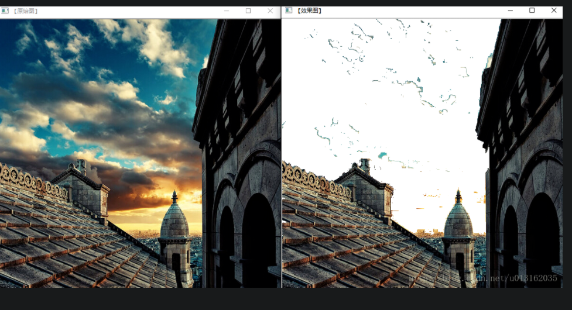

 通过此种方法可以不想要的内容。 

## 边缘检测

 Canny算子,Sobel算子,Laplace算子以及Scharr滤波器 

### 一般步骤

**1）滤波**：边缘检测的算法主要是基于图像强度的一阶和二阶导数，但导数通常对噪声很敏感，因此必须采用滤波器来改善与噪声有关的边缘检测器的性能。常见的滤波方法主要有高斯滤波，即采用离散化的高斯函数产生一组归一化的高斯核（具体见“高斯滤波原理及其编程离散化实现方法”一文），然后基于高斯核函数对图像灰度矩阵的每一点进行加权求和（具体程序实现见下文）。

 **2）增强**：增强边缘的基础是确定图像各点邻域强度的变化值。增强算法可以将图像灰度点邻域强度值有显著变化的点凸显出来。在具体编程实现时，可通过计算梯度幅值来确定 。

  **3）检测**：经过增强的图像，往往邻域中有很多点的梯度值比较大，而在特定的应用中，这些点并不是我们要找的边缘点，所以应该采用某种方法来对这些点进行取舍。实际工程中，常用的方法是通过阈值化方法来检测。 

 另外，需要注意，下文中讲到的Laplace算子，sobel算子和Scharr算子都是带方向的，所以，示例中我们分别写了X方向,Y方向和最终合成的的效果图。 

### canny算子篇

#### 简介

canny边缘检测算子是John F.Canny于 1986 年开发出来的一个多级边缘检测算法。更为重要的是 Canny 创立了边缘检测计算理论（Computational theory ofedge detection），解释了这项技术是如何工作的。Canny边缘检测算法以Canny的名字命名，被很多人推崇为当今最优的边缘检测的算法。

其中，Canny 的目标是找到一个最优的边缘检测算法，让我们看一下最优边缘检测的三个主要评价标准:

**1.低错误率:** 标识出尽可能多的实际边缘，同时尽可能的减少噪声产生的误报。

**2.高定位性:** 标识出的边缘要与图像中的实际边缘尽可能接近。

**3.最小响应:** 图像中的边缘只能标识一次，并且可能存在的图像噪声不应标识为边缘。 

为了满足这些要求 Canny 使用了变分法，这是一种寻找满足特定功能的函数的方法。最优检测使用四个指数函数项的和表示，但是它非常近似于高斯函数的一阶导数。

#### Canny 边缘检测的步骤

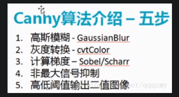

 **1.消除噪声。** 一般情况下，使用高斯平滑滤波器卷积降噪。 如下显示了一个 size = 5 的高斯内核示例: 

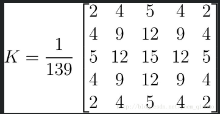

 **2.计算梯度幅值和方向。** 此处，按照Sobel滤波器的步骤。 

*  运用一对卷积阵列 (分别作用于 x 和 y 方向): 

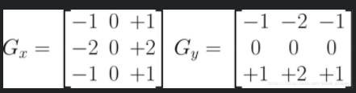

*  使用下列公式计算梯度幅值和方向: 

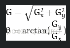

  梯度方向近似到四个可能角度之一(一般为0, 45, 90, 135) 

 **3.非极大值抑制**。 这一步排除非边缘像素， 仅仅保留了一些细线条(候选边缘)。 

 **4.滞后阈值。**最后一步，Canny 使用了滞后阈值，滞后阈值需要两个阈值(高阈值和低阈值): 

* 如果某一像素位置的幅值超过 高 阈值, 该像素被保留为边缘像素。

* 如果某一像素位置的幅值小于 低 阈值, 该像素被排除。

* 如果某一像素位置的幅值在两个阈值之间,该像素仅仅在连接到一个高于 高 阈值的像素时被保留。

 **tips：对于Canny函数的使用，推荐的高低阈值比在2:1到3:1之间。** 

#### Canny函数详解

 Canny函数利用Canny算法来进行图像的边缘检测 

~~~c++
void Canny(InputArray image,OutputArray edges, double threshold1, double threshold2, int apertureSize=3,bool L2gradient=false )
~~~

* 第一个参数，InputArray类型的image，输入图像，即源图像，填Mat类的对象即可，且需为单通道8位图像。
* 第二个参数，OutputArray类型的edges，输出的边缘图，需要和源图片有一样的尺寸和类型。
* 第三个参数，double类型的threshold1，第一个滞后性阈值。
* 第四个参数，double类型的threshold2，第二个滞后性阈值。
* 第五个参数，int类型的apertureSize，表示应用Sobel算子的孔径大小，其有默认值3。
* 第六个参数，bool类型的L2gradient，一个计算图像梯度幅值的标识，有默认值false。

> 1. 低于阈值1的像素点会被认为不是边缘；
> 2. 高于阈值2的像素点会被认为是边缘；
> 3. 在阈值1和阈值2之间的像素点,若与第2步得到的边缘像素点相邻，则被认为是边缘，否则被认为不是边缘。

 需要注意的是，这个函数阈值1和阈值2两者的小者用于边缘连接，而大者用来控制强边缘的初始段，推荐的高低阈值比在2:1到3:1之间。 

 调用示例： 

~~~c++
//载入原始图 
       Mat src = imread("1.jpg");  //工程目录下应该有一张名为1.jpg的素材图
       Canny(src, src, 3, 9, 3 );
       imshow("【效果图】Canny边缘检测", src);
~~~

### sobel算子篇

#### 基本概念

 Sobel 算子是一个主要用作边缘检测的离散微分算子 (discrete differentiation operator)。 它Sobel算子结合了高斯平滑和微分求导，用来计算图像灰度函数的近似梯度。在图像的任何一点使用此算子，将会产生对应的梯度矢量或是其法矢量。 

####  **sobel算子的计算过程** 

 我们假设被作用图像为 I.然后进行如下的操作： 

*  分别在x和y两个方向求导。 
  * 水平变化: 将 I 与一个奇数大小的内核进行卷积。比如，当内核大小为3时, 的计算结果为: 
  
    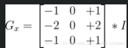
  
  *  垂直变化: 将: I 与一个奇数大小的内核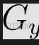进行卷积。比如，当内核大小为3时, 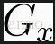 的计算结果为: 

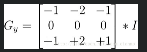

*  在图像的每一点，结合以上两个结果求出近似梯度: 

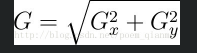

 另外有时，也可用下面更简单公式代替: 

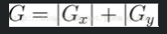

#### Sobel函数详解

 Sobel函数使用扩展的 Sobel 算子，来计算一阶、二阶、三阶或混合图像差分。 

~~~c++
void Sobel (
	InputArray src,//输入图
 	OutputArray dst,//输出图
 	int ddepth,//输出图像的深度
 	int dx,
 	int dy,
 	int ksize=3,
 	double scale=1,
 	double delta=0,
 	int borderType=BORDER_DEFAULT );
~~~

* 第一个参数，InputArray 类型的src，为输入图像，填Mat类型即可。
* 第二个参数，OutputArray类型的dst，即目标图像，函数的输出参数，需要和源图片有一样的尺寸和类型。
* 第三个参数，int类型的ddepth，输出图像的深度，支持如下src.depth()和ddepth的组合：
	* 若src.depth() = CV_8U, 取ddepth =-1/CV_16S/CV_32F/CV_64F
	* 若src.depth() = CV_16U/CV_16S, 取ddepth =-1/CV_32F/CV_64F
	* 若src.depth() = CV_32F, 取ddepth =-1/CV_32F/CV_64F
	* 若src.depth() = CV_64F, 取ddepth = -1/CV_64F
* 第四个参数，int类型dx，x 方向上的差分阶数。
* 第五个参数，int类型dy，y方向上的差分阶数。
* 第六个参数，int类型ksize，有默认值3，表示Sobel核的大小;必须取1，3，5或7。
* 第七个参数，double类型的scale，计算导数值时可选的缩放因子，默认值是1，表示默认情况下是没有应用缩放的。我们可以在文档中查阅getDerivKernels的相关介绍，来得到这个参数的更多信息。
* 第八个参数，double类型的delta，表示在结果存入目标图（第二个参数dst）之前可选的delta值，有默认值0。
第九个参数， int类型的borderType，我们的老朋友了（万年是最后一个参数），边界模式，默认值为BORDER_DEFAULT。这个参数可以在官方文档中borderInterpolate处得到更详细的信息。

 一般情况下，都是用ksize x ksize内核来计算导数的。然而，有一种特殊情况——当ksize为1时，往往会使用3 x 1或者1 x 3的内核。且这种情况下，并没有进行高斯平滑操作 

**一些补充说明：**

* 当内核大小为 3 时, 我们的Sobel内核可能产生比较明显的误差(毕竟，Sobel算子只是求取了导数的近似值而已)。 为解决这一问题，OpenCV提供了Scharr 函数，但该函数仅作用于大小为3的内核。该函数的运算与Sobel函数一样快，但结果却更加精确，其内核是这样的: 

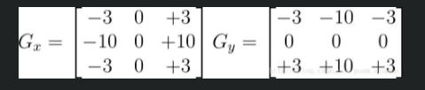

* 因为Sobel算子结合了高斯平滑和分化（differentiation），因此结果会具有更多的抗噪性。大多数情况下，我们使用sobel函数时，

  * 【xorder = 1，yorder = 0，ksize = 3】来计算图像X方向的导数，
  * 【xorder = 0，yorder = 1，ksize = 3】来计算图像y方向的导数。 计算图像X方向的导数，
  * 【xorder= 1，yorder = 0，ksize = 3】情况对应的内核： 

  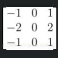

  而计算图像Y方向的导数，取【xorder= 0，yorder = 1，ksize = 3】对应的内核： 

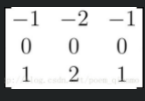


## 图像金字塔

高斯金字塔、拉普拉斯金字塔与图片尺寸缩放

 我们经常会将某种尺寸的图像转换为其他尺寸的图像，如果放大或者缩小图片的尺寸，笼统来说的话，可以使用OpenCV为我们提供的如下两种方式： 

*  resize函数。这是最直接的方式， 
*  pyrUp( )、pyrDown( )函数。即图像金字塔相关的两个函数，对图像进行向上采样，向下采样的操作。 

pyrUp、pyrDown其实和专门用作放大缩小图像尺寸的resize在功能上差不多，披着图像金字塔的皮，说白了还是在对图像进行放大和缩小操作。另外需要指出的是，pyrUp、pyrDown在OpenCV的imgproc模块中的Image Filtering子模块里。而resize在imgproc 模块的Geometric Image Transformations子模块里。


### 关于图像金字塔

图像金字塔是图像中多尺度表达的一种，最主要用于图像的分割，是一种以多分辨率来解释图像的有效但概念简单的结构。

图像金字塔最初用于机器视觉和图像压缩，一幅图像的金字塔是一系列以金字塔形状排列的分辨率逐步降低，且来源于同一张原始图的图像集合。其通过梯次向下采样获得，直到达到某个终止条件才停止采样。

金字塔的底部是待处理图像的高分辨率表示，而顶部是低分辨率的近似。

我们将一层一层的图像比喻成金字塔，层级越高，则图像越小，分辨率越低。

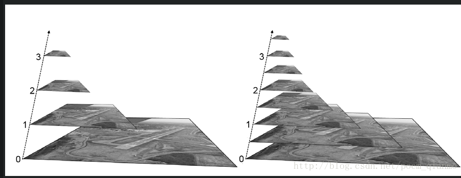

 一般情况下有两种类型的图像金字塔常常出现在文献和以及实际运用中。他们分别是: 

- <font color=red>高斯金字塔(Gaussianpyramid): 用来向下采样，主要的图像金字塔</font>
- <font color=red>拉普拉斯金字塔(Laplacianpyramid): 用来从金字塔低层图像重建上层未采样图像，在数字图像处理中也即是预测残差，可以对图像进行最大程度的还原，配合高斯金字塔一起使用。</font>

 两者的简要区别：高斯金字塔用来向下降采样图像（缩小），而拉普拉斯金字塔则用来从金字塔底层图像中向上采样（放大）重建一个图像。 

 要从金字塔第i层生成第i+1层（我们表示第i+1层为G_i+1），我们先要用高斯核对G_1进行卷积，然后删除所有偶数行和偶数列。当然的是，新得到图像面积会变为源图像的四分之一。按上述过程对输入图像G_0执行操作就可产生出整个金字塔。 

 当图像向金字塔的上层移动时，尺寸和分辨率就降低。OpenCV中，从金字塔中上一级图像生成下一级图像的可以用PryDown。而通过PryUp将现有的图像在每个维度都放大两遍。 

 图像金字塔中的向上和向下采样分别通过OpenCV函数 pyrUp 和 pyrDown 实现。 

- 对图像向上采样：pyrUp函数
- 对图像向下采样：pyrDown函数

 这里的向下与向上采样，是对图像的尺寸而言的（和金字塔的方向相反），**向上就是图像尺寸加倍，向下就是图像尺寸减半**。而如果我们按上图中演示的金字塔方向来理解，金字塔向上图像其实在缩小，这样刚好是反过来了。 

但需要注意的是，PryUp和PryDown不是互逆的，即PryUp不是降采样的逆操作。这种情况下，图像首先在每个维度上扩大为原来的两倍，新增的行（偶数行）以0填充。然后给指定的滤波器进行卷积（实际上是一个在每个维度都扩大为原来两倍的过滤器）去估计“丢失”像素的近似值。

PryDown( )是一个会丢失信息的函数。为了恢复原来更高的分辨率的图像，我们要获得由降采样操作丢失的信息，这些数据就和拉普拉斯金字塔有关系了。


### 对图像的向下取样  高斯金字塔

 为了获取层级为 G_i+1 的金字塔图像，我们采用如下方法: 

* 对图像G_i进行高斯内核卷积

* 将所有偶数行和列去除

得到的图像即为G_i+1的图像，显而易见，结果图像只有原图的四分之一。通过对输入图像G_i(原始图像)不停迭代以上步骤就会得到整个金字塔。同时我们也可以看到，向下取样会逐渐丢失图像的信息。

 以上就是对图像的向下取样操作，即缩小图像。 

 **高斯金字塔是**通过高斯平滑和亚采样获得一些列下采样图像，也就是说第K层高斯金字塔通过平滑、亚采样就可以获得K+1层高斯图像，高斯金字塔包含了一系列低通滤波器，其截至频率从上一层到下一层是以因子2逐渐增加，所以高斯金字塔可以跨越很大的频率范围。金字塔的图像如下： 

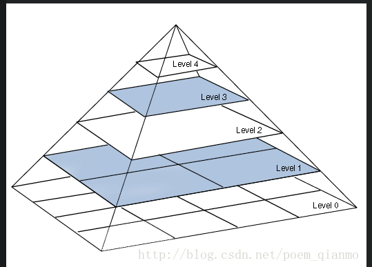

 另外，每一层都按从下到上的次序编号， 层级 G_i+1 (表示为 G_i+1尺寸小于第i层G_i)。 

###  对图像的向上取样  拉普拉斯金字塔

 如果想放大图像，则需要通过向上取样操作得到，具体做法如下： 

* 将图像在每个方向扩大为原来的两倍，新增的行和列以0填充

* 使用先前同样的内核(乘以4)与放大后的图像卷积，获得 “新增像素”的近似值

 得到的图像即为放大后的图像，但是与原来的图像相比会发觉比较模糊，因为在缩放的过程中已经丢失了一些信息，如果想在缩小和放大整个过程中减少信息的丢失，这些数据形成了拉普拉斯金字塔。 

 下式是拉普拉斯金字塔第i层的数学定义： 

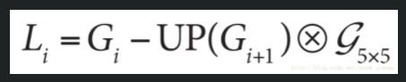

式中的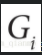表示第i层的图像。而UP（）操作是将源图像中位置为(x,y)的像素映射到目标图像的(2x+1,2y+1)位置，即在进行向上取样。符号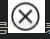表示卷积，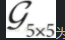为5x5的高斯内核。

我们下文将要介绍的pryUp，就是在进行上面这个式子的运算。

因此，我们可以直接用OpenCV进行拉普拉斯运算：

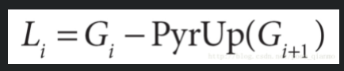

 也就是说，拉普拉斯金字塔是通过源图像减去先缩小后再放大的图像的一系列图像构成的。 

 整个拉普拉斯金字塔运算过程可以通过下图来概括： 

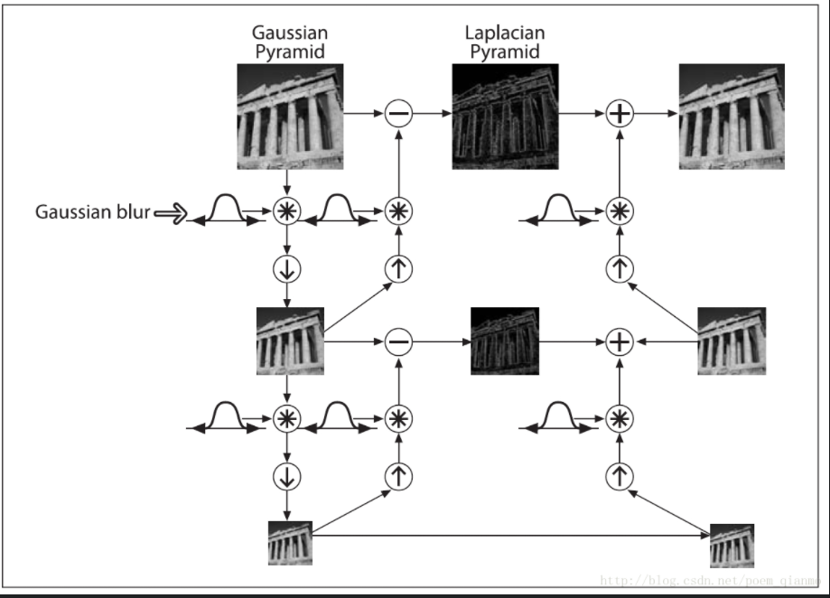

 所以，我们可以将拉普拉斯金字塔理解为高斯金字塔的逆形式。 

 **另外再提一点，关于图像金字塔非常重要的一个应用就是实现图像分割。图像分割的话，先要建立一个图像金字塔，然后在G_i和G_i+1的像素直接依照对应的关系，建立起”父与子“关系。而快速初始分割可以先在金字塔高层的低分辨率图像上完成，然后逐层对分割加以优化。** 

### resize( )函数剖析

 resize( )为OpenCV中专职调整图像大小的函数。 

此函数将源图像精确地转换为指定尺寸的目标图像。如果源图像中设置了ROI（Region Of Interest ，感兴趣区域），那么resize( )函数会对源图像的ROI区域进行调整图像尺寸的操作，来输出到目标图像中。若目标图像中已经设置ROI区域，不难理解resize( )将会对源图像进行尺寸调整并填充到目标图像的ROI中。

 很多时候，我们并不用考虑第二个参数dst的初始图像尺寸和类型（即直接定义一个Mat类型，不用对其初始化），因为其尺寸和类型可以由src,dsize,fx和fy这其他的几个参数来确定。 

 看一下它的函数原型： 

~~~c++
void resize(InputArray src,OutputArray dst, Size dsize, double fx=0, double fy=0, int interpolation=INTER_LINEAR )
~~~

* 第一个参数，InputArray类型的src，输入图像，即源图像，填Mat类的对象即可。

* 第二个参数，OutputArray类型的dst，输出图像，当其非零时，有着dsize（第三个参数）的尺寸，或者由src.size()计算出来。

* 第三个参数，Size类型的dsize，输出图像的大小;如果它等于零，由下式进行计算：

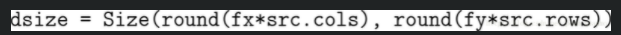

 其中，dsize，fx，fy都不能为0。 

* 第四个参数，double类型的fx，沿水平轴的缩放系数，有默认值0，且当其等于0时，由下式进行计算：

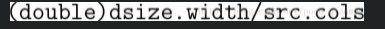

* 第五个参数，double类型的fy，沿垂直轴的缩放系数，有默认值0，且当其等于0时，由下式进行计算：

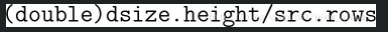

* 第六个参数，int类型的interpolation，用于指定插值方式，默认为INTER_LINEAR（线性插值）。

 可选的插值方式如下：

* INTER_NEAREST - 最近邻插值
* INTER_LINEAR - 线性插值（默认值）
* INTER_AREA - 区域插值（利用像素区域关系的重采样插值）
* INTER_CUBIC –三次样条插值（超过4×4像素邻域内的双三次插值）
* INTER_LANCZOS4 -Lanczos插值（超过8×8像素邻域的Lanczos插值）

 若要缩小图像，一般情况下最好用CV_INTER_AREA来插值， 

 而若要放大图像，一般情况下最好用CV_INTER_CUBIC（效率不高，慢，不推荐使用）或CV_INTER_LINEAR（效率较高，速度较快，推荐使用）。 

两种调用方式 

~~~c++
// 1
Mat dst=Mat::zeros(512 ,512, CV_8UC3 );//新建一张512x512尺寸的图片
Mat src=imread(“1.jpg”);
//显式指定dsize=dst.size（）,那么fx和fy会其计算出来，不用额外指定。
resize(src, dst, dst.size());

// 2
Mat dst;
Mat src=imread(“1.jpg”)
 //指定fx和fy，让函数计算出目标图像的大小。
resize(src, dst, Size(), 0.5, 0.5);
~~~

